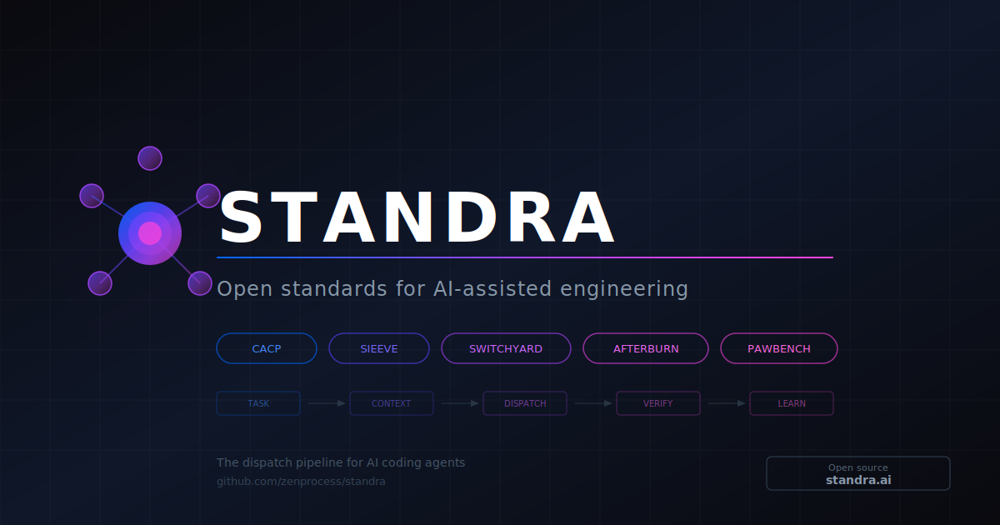
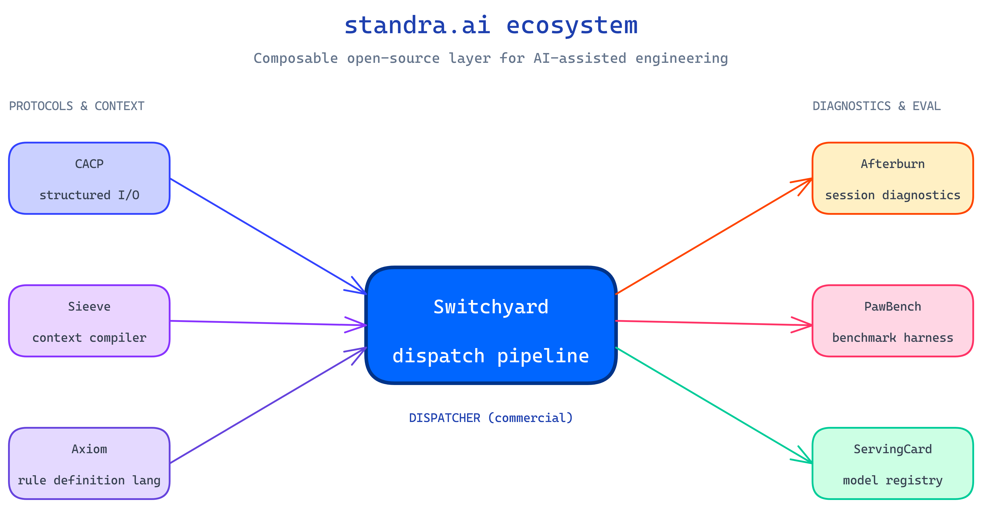
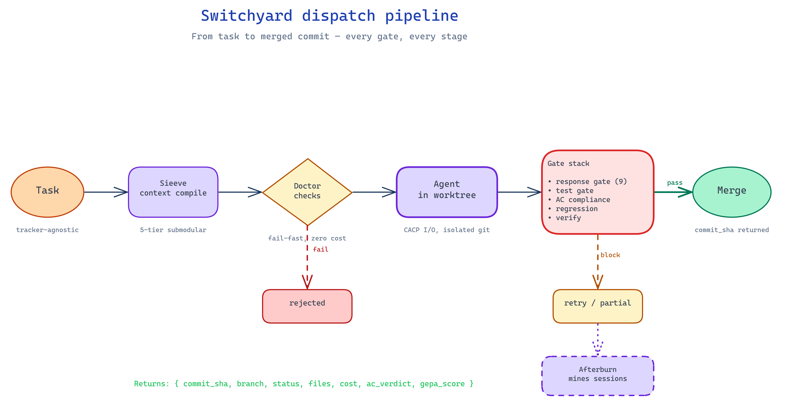

  

# standra.ai

**Open standards and tooling for AI-assisted engineering.**

The dispatch pipeline that makes AI coding agents reliable, measurable, and cheap to run at scale. Composable open-source components — pick the ones you need.

---

## The thesis

Most AI coding tools optimize a single agent doing a single task. That's the wrong unit of work.

The real bottleneck is **orchestration**: dispatching dozens of agents in parallel, giving each just the context it needs, verifying their output before merge, and learning from every dispatch to make the next one better.

`standra.ai` is the open layer for that. Each phase of the pipeline has a focused tool. Use them together or pick one.

---

## The pipeline

| Phase | What happens | Component | Repo |
|---|---|---|---|
| **Task** | Structured I/O — typed fields replace free-form prose. ~200 tokens vs ~2000. | **CACP** | [zenprocess/cacp](https://github.com/zenprocess/cacp) |
| **Context** | 5-tier submodular file assignment, task-aware retrieval, cache-aware optimization. | **Sieeve** | _open-source release pending_ |
| **Context (rules)** | Compact, tabular, LLM-native rule definition language. The format Sieeve compiles into. | **Axiom** | [zenprocess/axiom](https://github.com/zenprocess/axiom) |
| **Dispatch** | Tracker-agnostic, git-native multi-agent dispatcher. Pre-dispatch doctor, response gate, AC compliance, regression detection. | **Switchyard** _(commercial)_ | [Let's talk →](https://cal.com/vvladescu) |
| **Verify** | 4-dimensional benchmark harness — multi-turn, multi-agent, parallel dispatch with tool calling. | **PawBench** | [zenprocess/pawbench](https://github.com/zenprocess/pawbench) |
| **Verify (serving)** | Model registry for optimized LLM serving configurations. The "spec sheet" for self-hosted vLLM. | **ServingCard** | [zenprocess/servingcard](https://github.com/zenprocess/servingcard) |
| **Learn** | Mines Claude Code session history for friction, patterns, gaps. Evolves your skills via autonomous experiment loops. | **Afterburn** | [zenprocess/afterburn](https://github.com/zenprocess/afterburn) |

---

## The dispatch flow

A single Switchyard dispatch end-to-end:

1. **Task** comes in (GitHub, Linear, GitLab — tracker-agnostic), wrapped in **CACP**
2. **Sieeve** compiles task-aware context (Axiom rules + 5-tier file assignment)
3. **Pre-dispatch doctor** rejects bad dispatches instantly (zero cost)
4. Agent executes in **isolated git worktree** (Claude or local Hermes/vLLM)
5. **Gate stack** runs: response gate (9 structural checks), test gate, AC compliance, regression detection, verify
6. **GEPA** ([Goal/Effort/Plan/Assumptions](https://gepa-ai.github.io/gepa/blog/2026/02/18/introducing-optimize-anything/)) scores the trajectory — 4-dimensional reflective optimization
7. On pass → **merge**. On block → **retry/partial**. On doctor fail → **rejected**
8. **Telemetry** is mined by **Afterburn** to improve tomorrow's dispatch

---

## Compression stack

Every layer is measured.

| Layer | Tool | Savings |
|---|---|---|
| System prompt | Axiom compiled.ctx | 5000 → 500 tokens |
| Protocol | CACP structured fields | 2000 → 200 tokens/response |
| File context | Sieeve 5-tier submodular | Task-aware: FULL/SKELETON/SUMMARY/MANIFEST/OMITTED |
| Single file | Manifest vs inline | 50–100x per file |
| Mid-trajectory | AgentDiet pruning | 40–60% context reduction |

**Validated:** 87% token savings at parity on 684 compliance runs.

---

## Why this matters

Most AI coding work today is single-shot, manual, and unmeasured. Token costs are opaque. Quality is self-reported. There's no feedback loop.

`standra.ai` makes the whole pipeline:
- **Measurable** — every dispatch produces structured telemetry
- **Cheap** — context compilation is the difference between $0.50 and $5.00 per dispatch
- **Reliable** — gates catch false-positive "done" claims before they hit your branch
- **Self-improving** — Afterburn evolves your skills based on what actually worked

---

## Acknowledgements & inspiration

standra.ai stands on the shoulders of researchers and builders who shipped the foundational ideas:

- **[GEPA](https://gepa-ai.github.io/gepa/blog/2026/02/18/introducing-optimize-anything/)** — Goal/Effort/Plan/Assumptions reflective prompt optimization. Switchyard scores every dispatch on these 4 dimensions and feeds the verdict back into routing. *Agrawal et al., 2026*
- **[RLM (Recursive Language Models)](https://arxiv.org/abs/2512.24601)** — *Zhang, Kraska & Khattab*. The REPL-driven recursive analysis pattern that lets Afterburn process 90MB+ session files no context window can hold.
- **[CCAR (Claude Code AutoResearch)](https://github.com/mitkox/ccar)** — *Mitko Vasilev*. The autonomous experiment loop Afterburn uses to evolve skills (mutate → benchmark → keep/discard → commit).
- **[Andrej Karpathy](https://karpathy.ai/)** — *Software 2.0*, *LLM OS*, and the public thinking on agentic systems that frames why orchestration is the real engineering problem, not the model.
- **[addyosmani/agent-skills](https://github.com/addyosmani/agent-skills)** — *Addy Osmani*. The Save Point Pattern, anti-rationalization tables, and skills-as-gated-workflows pattern that shape how Switchyard structures dispatch prompts.
- **[DSPy](https://dspy.ai/)** — *Stanford NLP*. The original GEPA optimizer and the systematic approach to LM programming that influenced CACP's structured I/O design.
- **[LLMLingua](https://github.com/microsoft/LLMLingua)** — *Microsoft Research*. Prompt compression research underpinning Sieeve's tiered context strategy.

If we missed your work and you should be on this list — open an issue.

---

## Get involved

- ⭐ Star the components that interest you
- 🐛 File issues — every open-source project welcomes them
- 💬 Discussions are open
- 📧 [hello@standra.ai](mailto:hello@standra.ai)

For Switchyard (commercial dispatcher), [let's talk →](https://cal.com/vvladescu).

---

  <em>standra.ai — Open Standards for the AI-Ready Enterprise</em>

